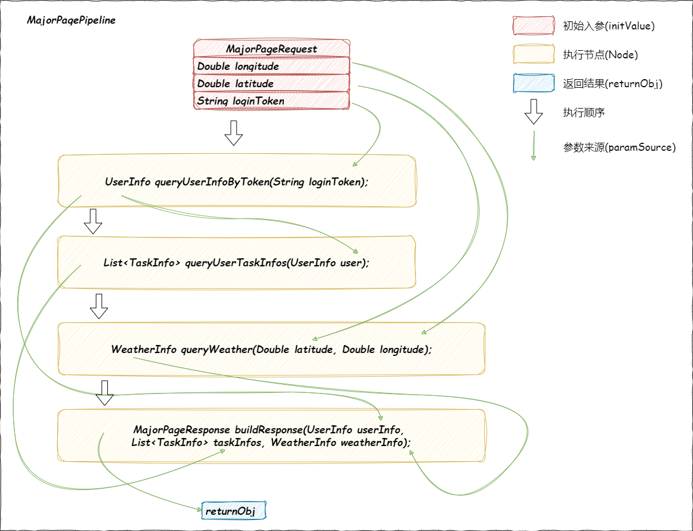
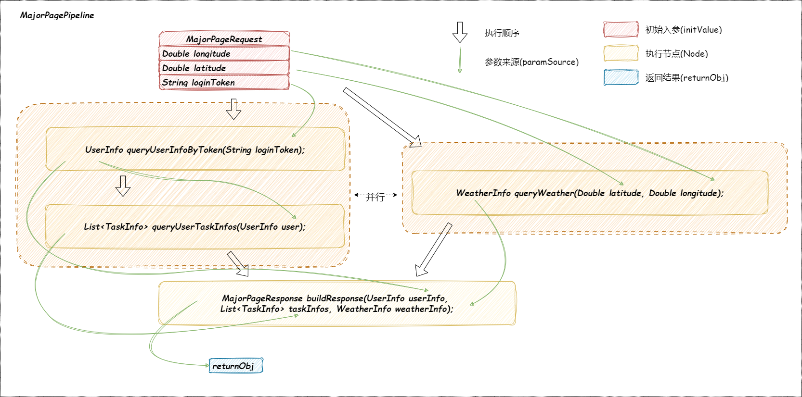

<h1 align="center">
  jinxiu-road 锦绣路
</h1>

<h4 align="center">
需要编排可灵活复用 无需编排可极致加速
</h4>

## 核心功能

例如实现一个主页信息查询的接口，实现通过token查询当前用户信息、查询用户任务列表、查询当前天气等逻辑节点。

- 其中每个执行节点(node)仅需关注自身方法需要什么入参以及声明返回值，jinxiu-road会根据入参类型从前置节点以及初始值中寻找类型相同的参数传入方法。
- 每个节点可以灵活替换，在构建流水线时只需要参数和返回值能匹配成功即可构建。

## 并行执行能力

- 根据参数解析依赖关系，将可以并行执行的node并行处理。
- 线程池提供默认实现，同时可自定义替换。

## 快速开始

[快速开始](readme/quickStart.md)
## 当前已知问题

- [ ] 没有依赖关系图化表达(想想是一件有点难做的事情，懒得做)。
- [ ] 扩展能力不够完善，例如对于参数选择、日志处理等部分的处理不够优雅，这个持续优化，目前api没有完全确定。
- [ ] 异常处理不够优雅，尤其是并行实现中对异常的处理，还在探索如何优雅处理。
- [ ] 节点前后依赖关系是通过参数来做的，并没有提供自定义调整的能力，预期是在创建pipelineMeta的时候可以声明依赖关系，但是没有想好怎么做。
- [ ] 还有些小问题，比如单元测试不够完善等。慢慢完善。。

## 写在最后

+ 本项目起源于与朋友的一次闲谈，想要让需要流程编排的项目能有更优雅的实现，让node编写更优雅不需要考虑太多，同时开发过程中发现可以将没有依赖关系的node并行执行。
  灵感依赖落地代码就快得多。 
+ 本项目还在不断演进阶段，同时设计也并不复杂，欢迎有想法的朋友提出pr或者issue，如果能点一个star就足够我开心到想倒立🤸‍♀️。
+ 本项目遵循Apache License2.0协议，可以不受限制地将代码用在任何地方。(
  如果你们某天收到的面试者的简历中说他是这个项目的开发者的话，还望可给一个面试机会哈哈哈)
+ 至于为什么叫锦绣路，因为那是我女朋友家门口的路名👩‍❤️‍👨。

## Star History

